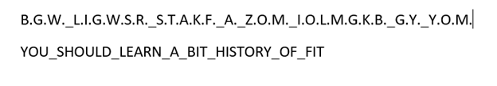
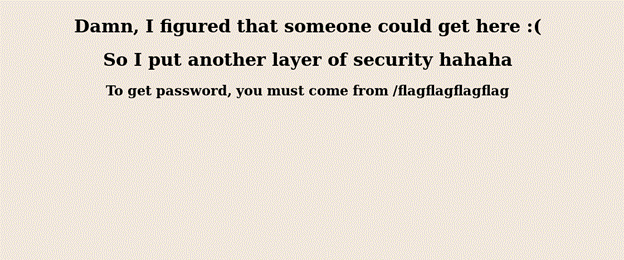
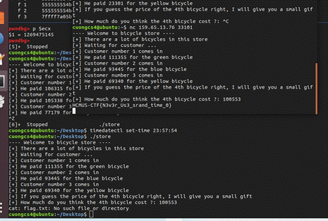

# HCMUS-CTF WriteUp - Ei5EqD

## FORENSICS
### Liberate:
- Exiftool xong có dòng cmt và description ascii85 ở trên.

	Flag: HCMUS-CTF{uSed_ASCII85_encoder}

### Workers' Day
- Dùng Steghide

	Flag: HCMUS-CTF{simply_use_steghide_to_hiding_something}

### Atleast
- Dùng tool zsteg

	Flag: HCMUS-CTF{there_is_somthing_I_wanna_hide}

### Galaxy

- Sử dụng audacity xong xài spectrum

	 

	Flag: HCMUS-CTF{sound_likes_Outer_Space}

### Insideme
- Đầu tiên ghi gặp 1 file ảnh, thường thì sẽ thử unzip file để coi có file ngầm nào bên trong không.
- Vô tình ta unzip đc 1 thư mục gồm 1 file pdf và 1 file rtf. Thử mở file PDF thì thấy lỗi

- Có vẻ đây là 1 file jpg, thử đổi tên file mở lên ta được

)))
- cat flag.txt and see the flag
 
  	Flag: HCMUS-CTF{Docker_Is_an_essential_tool_You_have_to_learn_FORRRRSURRREEEE}

### Crime
- Mở file .001 bằng 7zip
- Thấy có cái langue và file rar có password và hình zodiac
- Search google ra zodiac cipher killer: https://www.dcode.fr/zodiac-killer-cipher

- Ra pass của file rar là FITPASS
- Giải nén mở file flag.txt

        Flag: HCMUS-CTF{social_distancing_for_this_pandamic}

### Actually At least	
- Sử dụng tool  https://georgeom.net/StegOnline/image
- Chọn extract data và tick như hình. Bài này giải được khá vô tình ( lúc sau đọc lại đề mới thấy có chữ RED )

- Ta thu được

	Flag: HCMUS-CTF{You_should_learn_LSB_embeded_system}

### Qemu
- DOWNLOAD FILE
- Launch qemu file by:
	qemu-system-x86_64 -hda ubuntu.qcow2 -m 1024

- Enter password hcmus-ctf
- Searching the flag on that computer

      Flag: HCMUS-CTF{just_try_to_teach_you_qemu}

## CRYPTOGRAPHY
### Decoder
- Giải bằng base64 xong nó hiện ra base64/2 tức là base32 giải 1 lần nữa là được

      Flag: HCMUS-CTF{jUst_SimplE_Decoder}

### Dot and Underscore:
- Xài morse là ra

      Flag: HCMUS-CTF{ITSGOODTOLEARNMORSECODE}

### Sub
- Đọc file sub ta thấy có dòng BGW_LIGWSR_STAKF_A_ZOM_IOLMGKB_GY_YOM nghi vấn là nội dung flag
- Phân tích ta thấy các kí tự của nội dung gốc đã bị thay thế bằng các kí tự khác. Lần lượt thay các kí tự, sử dụng dấu chấm để đánh dấu kí tự nào chưa bị thay

	 
	Flag: HCMUS-CTF{YOU_SHOULD_LEARN_A_BIT_HISTORY_OF_FIT}

### Xor
- Sử dụng http://xor.pw/# . Do đã biết flag sẽ có phần đầu là HCMUS-CTF. Nên ta xor các kí tự đầu của chuỗi encrypt với phần đầu trên. Kết quả cho thấy key là FIT

	Flag: HCMUS-CTF{XoR_1s_a_KinD_oF_Crypto}

### Factorization
- Sử dụng script sau

	Flag: HCMUS-CTF{smaLL_NumbeR}

### Very secure RSA
- ./RsaCtftool.py -n .. -c -e –attack fermat

	Flag: HCMUS-CTF{c775e7b757ede630cd0aa1113bd102661ab38829ca52a6422ab782862f268646}

### Smalee
- Tìm được n và e

- ./RsaCtftool.py -n  .. --uncipher .. -e 3 –attack hastads

- Tìm ra plaintext nhưng đã bị xor với xorkey
- Sử dụng hàm này
	def str_xor(s1, s2): 
    return "".join([chr(ord(c1) ^ ord(c2)) for (c1,c2) in zip(s1,s2)])

- Mà em nộp thì nó bảo sai, em xoá hết chữ z thì nó đúng.
   
        Flag: HCMUS-CTF{hello_from_the_other_side}
	
### The Ripper
- Sử dụng john tools

- Xong nc với server là ra

        Flag: HCMUS-CTF{Use_John_the_ripper_to_crack_password_is_fun!!!HAHAHA}

## REVERSE ENGINEERING
### Factorization Revenge
- ./RsaCtftool.py -n .. -c -e –attack fermat	 

        Flag: HCMUS-CTF{haaaaah_what_do_you_really_want_from_meeeeeee}

### PatientRevenge
- Autoclick

        Flag: HCMUS-CTF{I_hope_u_dont_click_it_by_hand}

### PatientRevengeRevenge

- Lần này thấy file có vẻ đã được thêm code để làm delay thời giữa các lần click
- Dùng IDA để xem code ta thấy có câu lệnh sleep, chỉnh sửa giá trị truyền vào hàm sleep về 0, rebuild lại file sau đó dùng auto click tương tự 2 bài trước

- ARC Four tìm hiểu thêm :))

    	Flag: HCMUS-CTF{d0_y0u_kn0w_ARc_fourrrrrrrrrrrr}
	
### Stackstring
- Sử dụng pwngdb
- Sau đó r để chương trình cập nhật địa chỉ trên RAM
- Disas main lấy địa chỉ của strcmp
- b *add ngay đó
- r sẽ hiện ra

	Flag: HCMUS-CTF{St4cK_Str1ng_G00D_old_techn1qu3}

### Patient
- Xài auto click

	Flag: HCMUS-CTF{W0W_y0u_are_p4tient}

## WEB EXPLOITATION
### baby sql
- Đăng nhập với username là admin password là ' or '1'='1 mệnh đề luôn đúng

	Flag: HCMUS-CTF{Sh0uld_N0tz_Conc4ten4te_S+r1ng_SQQLLL}

### Secret Agency
- Xem page source ta thấy có 1 comment  <!-- secret agent = eevee →
- Chỉnh sửa agent xong refresh lại website

	
	
	Flag: HCMUS-CTF{+he_4g3nt_Izzz_eevoolution0123456}

### Secret Directory
- view some challenges before 
    ●	http://159.65.13.76:1339/ 
    ●	http://159.65.13.76:1337/
    => the missing directory is :1338/
- “Google can’t find it” => robots.txt

- We have some directory

- Go to /flagpassword

- “You must come from /flagflagflagflag” => goto /flagflagflagflag then back to this… but
- We have some problem 

- Open burpsuite and catch some package from /flagpassword

Add referrer to the package.
- We get the password to access /flagflagflagflag

- We got the flag

 
 
	Flag: HCMUS-CTF{1t_1zzzz_Crucial_t0_kn0W_Headers_and_R0b0tz}

### Blind SQL
- Check thử tên thử tên admin thì hiện thông báo có tồn tại 

- Sử dụng lệnh này
    ./sqlmap.py http://159.65.13.76:1340/ --data="username=admin" --dbs
	 
	./sqlmap.py -u http://159.65.13.76:1340/ --data="username=admin" --table -D blind-sql
	Tìm dược bảng account
	

	 
	 
	./sqlmap.py -u http://159.65.13.76:1340/ --data="username=admin" --dump -D blind-sql -T account 
	

	Flag: HCMUS-CTF{Sh0uld_I_Us3_NoSQL_N3xt_T1m3_0x3f3f3f}

## PWN
### Tell me

	Flag: HCMUS-CTF{Ohhh~Just_give_me_the_credential!!Nah}

### Store
- Dùng IDA để đọc code store. Để ý thấy có sử dụng hàm rand() và srand(time(0))
    => Tại 1 thời điểm xác định luôn tạo ra các bộ số như nhau
    => Dùng 2 tab terminal kết nối tới server và mở store cùng lúc, ta sẽ được 2 bộ số như nhau. Xác định lại đúng thời điểm xuất ra bộ số đó với lệnh timedatectl set-time hh:mm:ss
- Sau đó dùng GDB để chạy code tìm ra số thứ 4 trả về sau khi chạy hàm create_customer lần thứ 4
- Sau đó qua tab kết nối với server nhập kết quả ta được flag

	Flag: HCMUS-CTF{N3v3r_Us3_srand_time_0}

### Secret

- Đọc asm sấp mặt và nhận ra cái hàm strcmp có lỗ hổng
- Vì hàm strcmp trả về số nguyên nên chỉ cần match giá trị đầu là được
- Nên mình nc xong nhập H 

	Flag: HCMUS-CTF{strncmp_is_so_fun}

### Flow me
- Xài pwngdb thì thấy có thể xài overflow được.
- Xong xài python -c “print ‘A’*16*4*4 + 8*’A’ + ‘\xae\x07\x40\x00’” > file 
- Xong nc ip port < file

	 

	Flag: HCMUS-CTF{You_have_to_learn_basic_stack_based_buffer_overflow}

### Z3

	Flag: HCMUS-CTF{H4v3_y0u_ev3r_he4rd_0f_z3}

	

 

